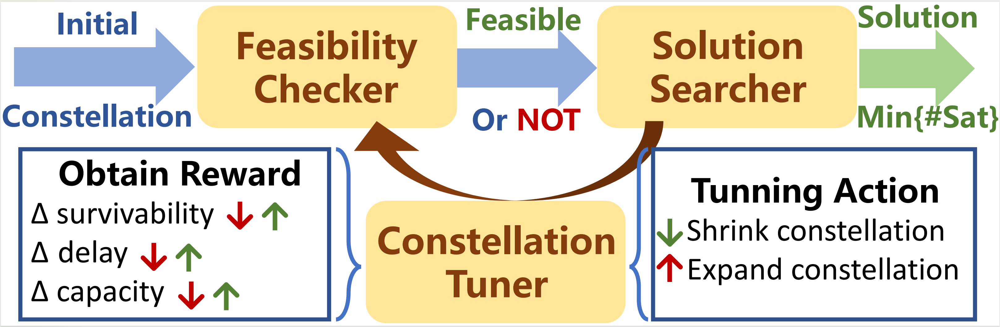

# MegaReduce

MegaReduce is a project investigating an important research problem facing the upcoming satellite Internet: from a
network perspective, how many satellites exactly do we need to construct a survivable and performant LSN?

This repo contains the source codes of MegaReduce and examples to demonstrate its usage in optimizing the
incremental deployment and long-term maintenance of future satellite Internet.

## Working principle

This project can achieve an automatic reduction of constellation size and avoid NP-hard problems.

Given the initial configuration of a constellation, the constellation size is optimized after being checked for
survivability and performance requirements

## Code Introduction

#### The working environment needs to use python 3 version, you just need`python3 MR_demo.py` to run this code.

#### Change your requirement and set your input in `configuration.json`

### Each file's function

- `Topo.py` and `Constellation_model.py` describe how communication take place in satellite networks and generate the
  data structure of the graph.
- `utils.py` provide Coordinate transformation, graph algorithm and methods for finding disjoint paths.
- `gw_amazon.json` and `gw_starlink.json` describe the location of ground stations of each satellite network.

### how to use demo?

#### Modify `configuration.json`

1. Specify the initial constellation configuration
   assign `init_con`,each item in list
   means [Shell number, altitude, orbital inclination, number of orbits, number of satellites per orbit] of a
   constellation respectively.
2. Figure out the file path of ground stations  
   By default,we provide the potential ground stations' locations in first half of 2023.
3. Specify `delay constraints`, which means The hop count of the optional path should be less than the value multiplied
   by the shortest hop count.
4. Select the geographical location of the communication point. Make them evenly distributed across the globe.
5. Specify the Survivability requirement `survivability`,which means the disjoint path between any two communication
   pairs should not be less than this value.
6. In order not to take too long, we set the number of iterations to no more than ten.
   `` if (shrink_count + expand_count) > iterations and ret`` as condition for the end of the program.

#### The iteration result is shown in `con_log.log`

#### Modify the shrink/expand algorithm in `MR_demo.py`

1. Design expansion and shrinking strategies for constellations in function `con_expand` and `con_shrink`.
   We use the method described in paper by default.You change the step-size,even this method to fit your requirement.

2. If you want to simulate the random damage or concentrated damage, uncommenting the function `stochastic_down`
   or`sun_storm_emulation`
   in `Constellation_model.py`.
